# Co-Intelligence V1.0 Beta

**Where Human Meets AI Intelligence**

A scalable multi-AI platform with FastAPI backend, Next.js frontend, deployed on AWS EKS.

## Architecture

- **Backend**: FastAPI + Tortoise ORM + LangGraph 1.0.1 + App Registry System
- **Frontend**: Next.js 14 (App Router) + Reusable Components
- **Database**: AWS RDS PostgreSQL
- **AI Models**: Gemini 2.5 Flash Lite, Groq Mixtral, AWS Bedrock Nova
- **Code Execution**: AWS Lambda (autonomous Python execution)
- **Infrastructure**: AWS EKS (t3.medium), ECR, S3, Lambda
- **Region**: us-east-1

## Applications

### 1. Chat
- 🤖 **AI Chat** - Switch between 8 AI models across 3 providers
- 📄 **Document Analysis** - PDF, DOCX, TXT support with text extraction
- 🌐 **Web Search** - Real-time internet search (Tavily integration)
- ⚡ **Code Execution** - AI automatically runs Python code when needed
- 💬 **Streaming Responses** - Real-time AI responses

### 2. Agentic Barista
- ☕ **LangGraph Workflow** - Multi-agent system with state management
- 🤖 **3 Specialized Agents** - Menu, Order, and Confirmation agents
- 🧠 **AI Reasoning** - Intent detection with conversational handling
- 🛒 **Cart Management** - Add/remove items, view totals
- 📋 **Menu Discovery** - Browse coffee, pastries, and food items
- ✅ **Order Confirmation** - Complete orders with database persistence
- 💬 **Floating Chat UI** - Modal popup interface with agent status display

### 3. Insurance Claims
- 🏥 **Role-Based Workflow** - Multi-role system (customer, agent, adjuster, manager, admin)
- 📋 **Policy Management** - Create and manage insurance policies
- 📝 **Claim Submission** - Submit claims with incident details
- 🔄 **Status Workflow** - Role-based claim status transitions
- 👥 **Adjuster Assignment** - Managers assign claims to adjusters
- 💰 **Damage Assessment** - Track estimated and approved amounts
- 📎 **Notes & Documents** - Add notes and attachments to claims
- 🔐 **Access Control** - Role-based permissions and data visibility

### 4. Agentic LMS
- 🎓 **AI Course Discovery** - Natural language course search
- 📚 **Natural Language Enrollment** - Conversational enrollment process
- 📊 **Progress Tracking** - Track learning progress
- 🤖 **LangGraph Agents** - Multi-agent orchestration for learning

### 5. Agentic Tutor
- 🎯 **Interactive Learning** - AI tutor for Python, AI, Data Science, and more
- 📝 **Practice Assessments** - Generate quizzes and coding challenges
- 🤖 **Multi-Agent System** - Tutor, Assessor, Grader, Hint, and Progress agents
- 📊 **Progress Tracking** - Track scores, strengths, and improvement areas
- 📚 **15 Topics** - Across 5 categories with beginner to advanced levels

## Platform Features

- 🔐 **Secure Authentication** - JWT-based user authentication
- 👤 **User Profile Header** - Reusable AppHeader component with logout functionality
- ☁️ **Cloud Native** - Deployed on AWS EKS with auto-scaling
- 🧩 **Modular Architecture** - Add new apps in 10 minutes
- 🔄 **App Registry System** - Auto-discovery and registration of apps
- 🎨 **Component Library** - Reusable UI components (Card, Modal, Button)
- 🪝 **Custom Hooks** - useAuth hook for centralized authentication
- 📦 **Shared Base Models** - Timestamp and soft delete mixins
- 🛠️ **App Scaffolding** - CLI tool to generate new apps instantly

## Screenshots

### Homepage
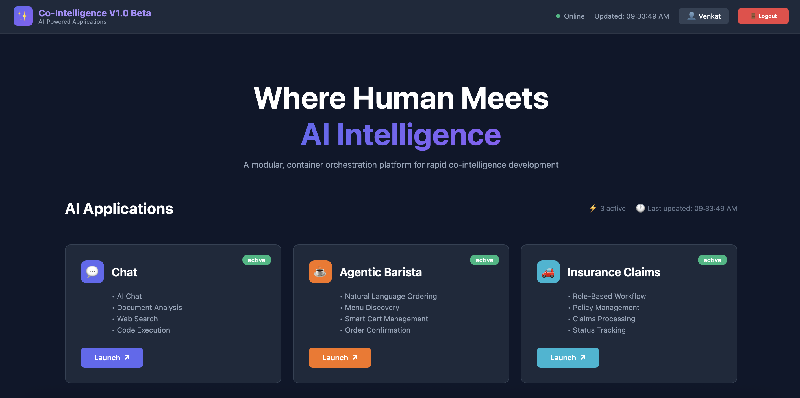

### Co-Intelligence - AI Applications
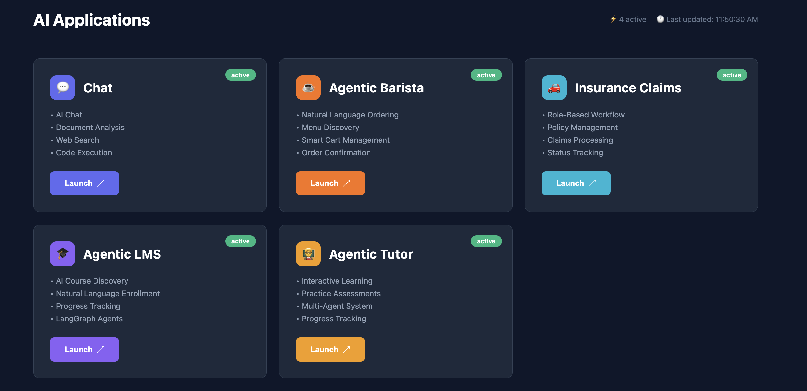

### Platform Features
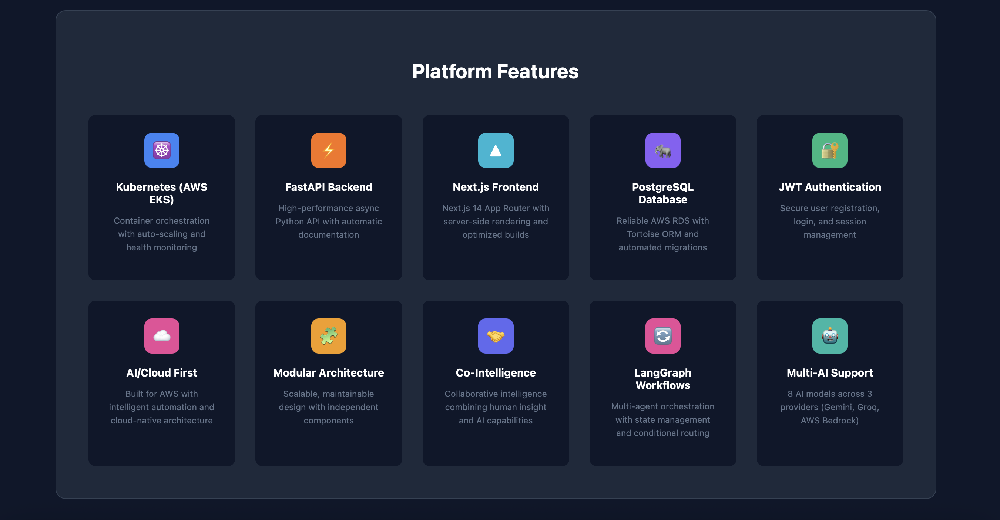

### Platform Metrics
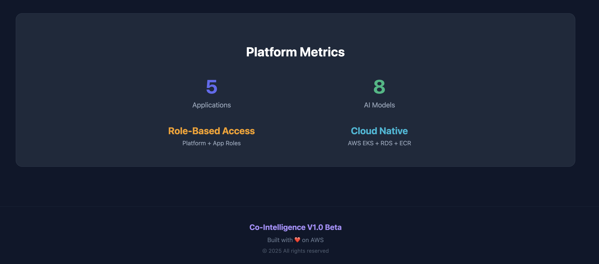

### AI Chat
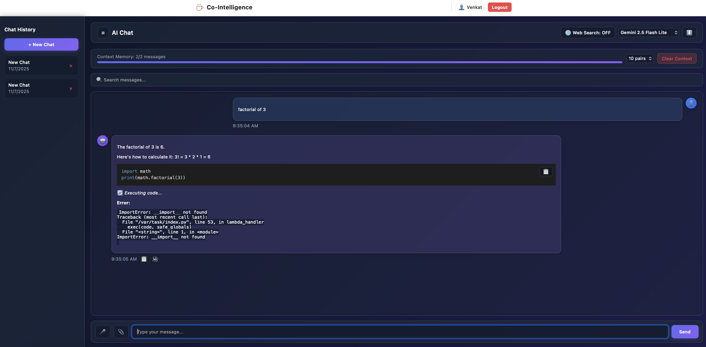

### Agentic Barista
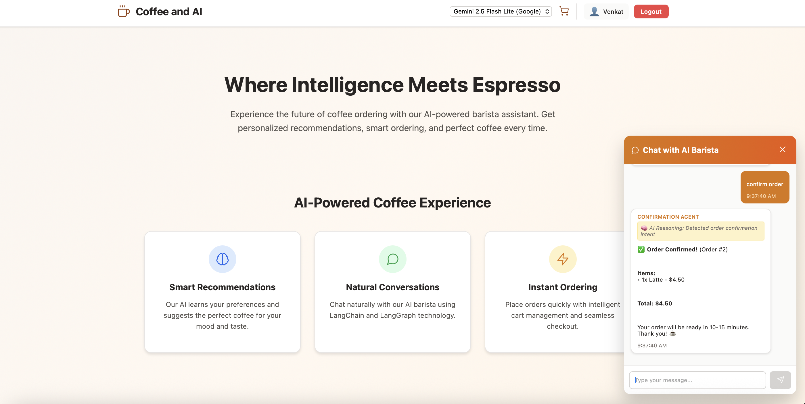

### Insurance Claims
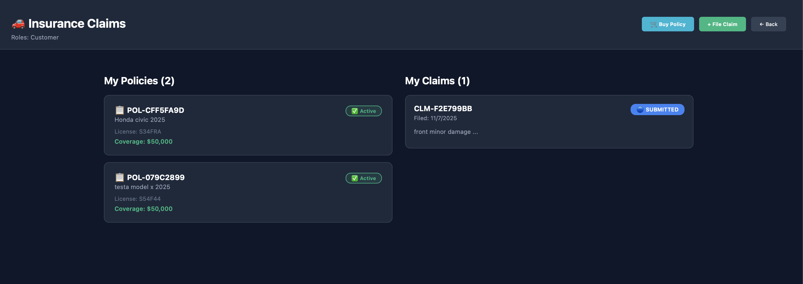

### Learning Management System


### LMS Screen2
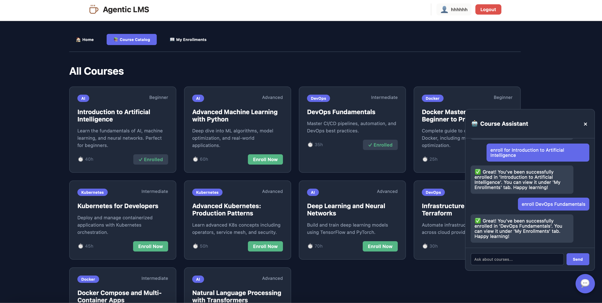

### Agentic Tutor
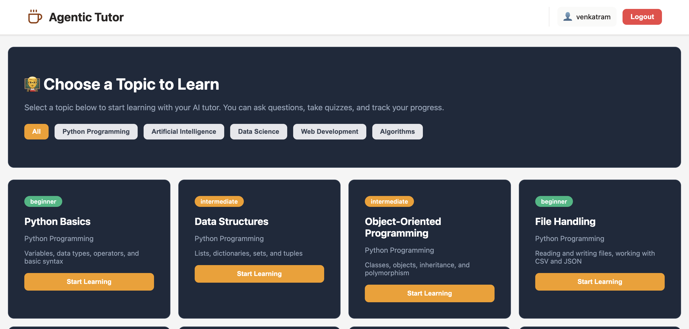

### Agentic Tutor - Learning
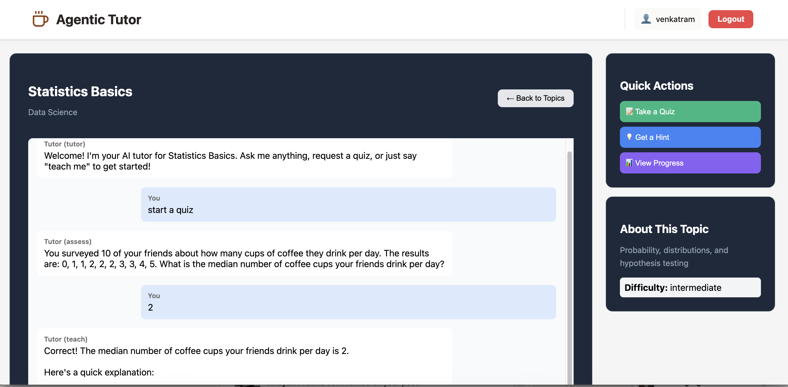

### Agentic Tutor - Agent Flow
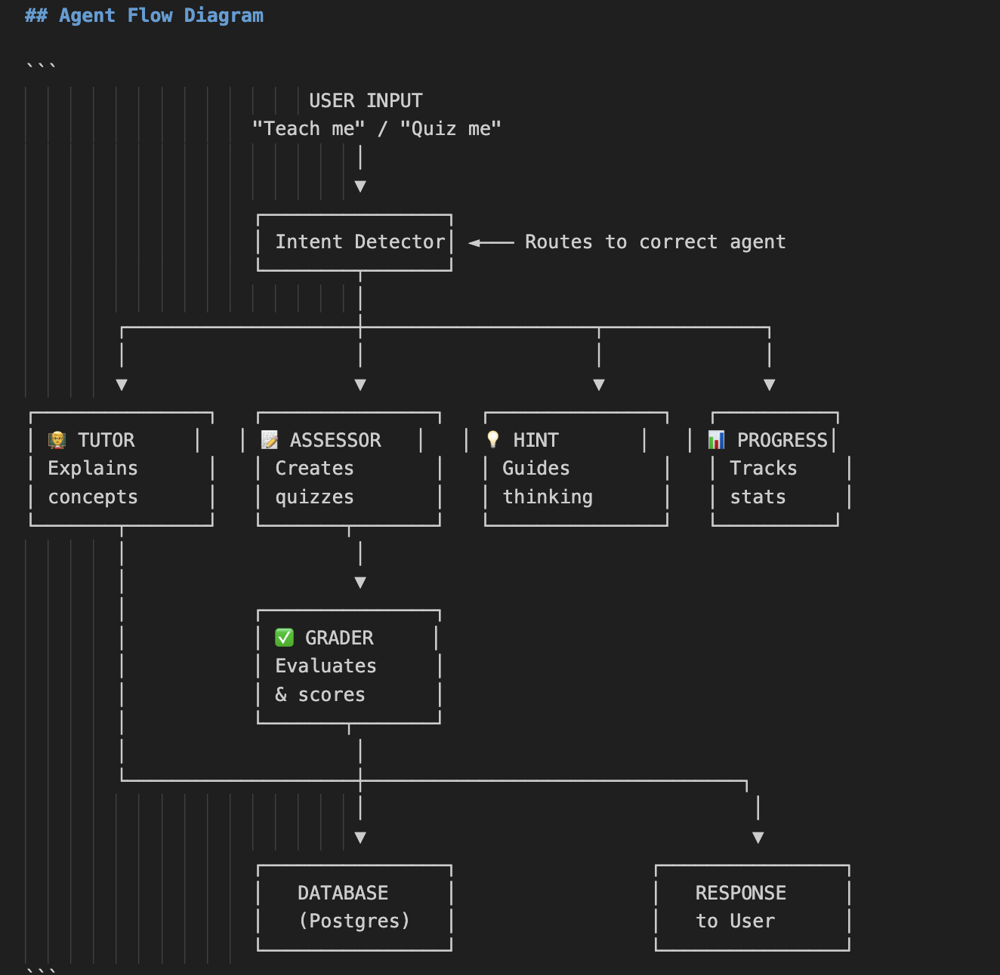

### AWS EKS Screen
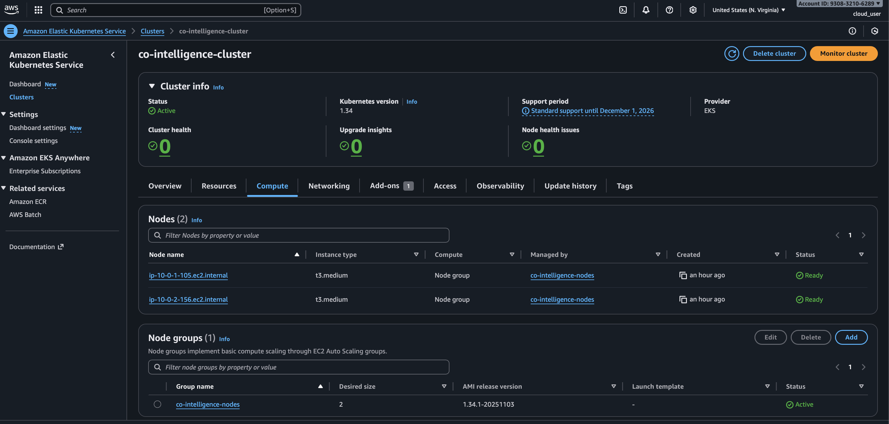

### Design
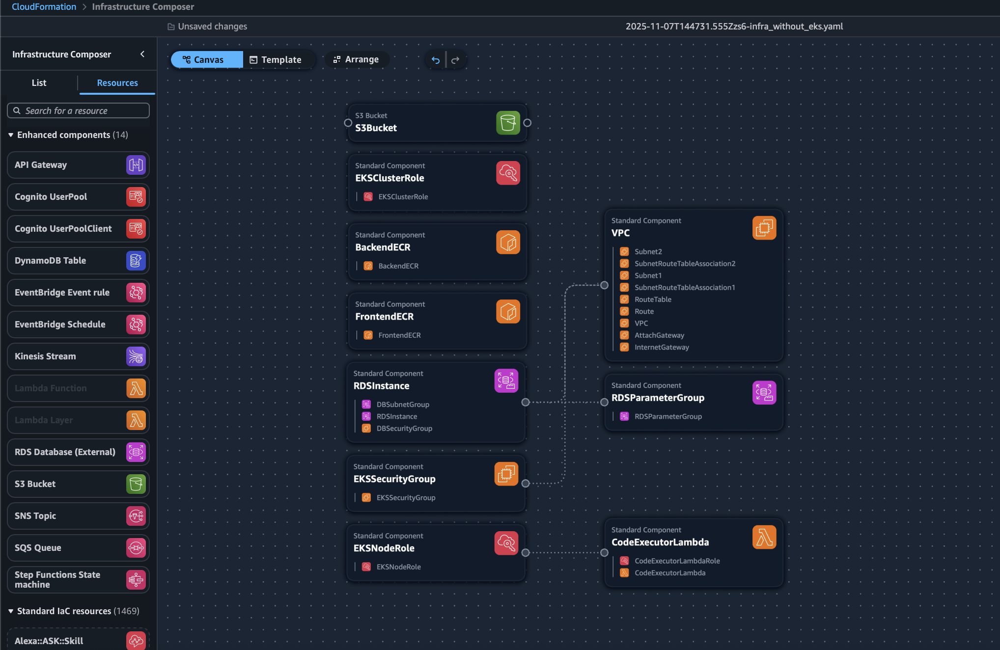

## Prerequisites

- AWS CLI configured
- Docker installed
- kubectl installed
- Node.js 20+
- Python 3.11+

## Setup Instructions

### Option 1: Automated Deployment (Recommended)

After creating the CloudFormation stack and configuring `.env`:

```bash
# Run automated deployment script
./deploy.sh
```

This script will:
- Verify CloudFormation stack and RDS availability
- Build and push Docker images to ECR
- Create Kubernetes secrets
- Deploy backend and frontend to EKS
- Set up LoadBalancers and wait for health checks
- Display access URLs

### Option 2: Manual Deployment

### 1. Deploy AWS Infrastructure

```bash
cd infrastructure

# Deploy CloudFormation stack
aws cloudformation create-stack \
  --stack-name co-intelligence \
  --template-body file://infra_without_eks.yaml \
  --parameters ParameterKey=DBUsername,ParameterValue=cointelligence \
               ParameterKey=DBPassword,ParameterValue=YourSecurePassword123 \
  --capabilities CAPABILITY_IAM CAPABILITY_NAMED_IAM \
  --region us-east-1

# Wait for stack creation
aws cloudformation wait stack-create-complete \
  --stack-name co-intelligence \
  --region us-east-1

# Get outputs
aws cloudformation describe-stacks \
  --stack-name co-intelligence \
  --region us-east-1 \
  --query 'Stacks[0].Outputs'
```

### 2. Configure Environment

Copy `.env.example` to `.env` and fill in values from CloudFormation outputs:

```bash
cp .env.example .env
# Edit .env with your values
```

### 3. Build and Push Docker Images

```bash
# Get AWS account ID
ACCOUNT_ID=$(aws sts get-caller-identity --query Account --output text)

# Login to ECR
aws ecr get-login-password --region us-east-1 | \
  docker login --username AWS --password-stdin $ACCOUNT_ID.dkr.ecr.us-east-1.amazonaws.com

# Build and push backend
cd backend
docker build -t co-intelligence-backend .
docker tag co-intelligence-backend:latest $ACCOUNT_ID.dkr.ecr.us-east-1.amazonaws.com/co-intelligence-backend:latest
docker push $ACCOUNT_ID.dkr.ecr.us-east-1.amazonaws.com/co-intelligence-backend:latest

# Build and push frontend
cd ../frontend
docker build -t co-intelligence-frontend .
docker tag co-intelligence-frontend:latest $ACCOUNT_ID.dkr.ecr.us-east-1.amazonaws.com/co-intelligence-frontend:latest
docker push $ACCOUNT_ID.dkr.ecr.us-east-1.amazonaws.com/co-intelligence-frontend:latest
```

### 4. Deploy to EKS

```bash
# Update kubeconfig
aws eks update-kubeconfig --name co-intelligence-cluster --region us-east-1

# Update K8s manifests with your account ID
cd ../k8s
sed -i "s/<ACCOUNT_ID>/$ACCOUNT_ID/g" backend-deployment.yaml
sed -i "s/<ACCOUNT_ID>/$ACCOUNT_ID/g" frontend-deployment.yaml

# Create secrets (copy template and fill values)
cp secrets.yaml.template secrets.yaml
# Edit secrets.yaml with your actual values

# Apply manifests
kubectl apply -f secrets.yaml
kubectl apply -f backend-deployment.yaml
kubectl apply -f backend-service.yaml
kubectl apply -f frontend-deployment.yaml
kubectl apply -f frontend-service.yaml

# Get LoadBalancer URL
kubectl get svc frontend -w
```

### 5. Local Development

```bash
# Start local environment
docker-compose up

# Backend: http://localhost:8000
# Frontend: http://localhost:3000
# API Docs: http://localhost:8000/docs
```

## API Endpoints

### Authentication
- `POST /api/auth/register` - Register new user
- `POST /api/auth/login` - Login user
- `GET /api/auth/me` - Get current user

### AI Chat
- `POST /api/apps/ai-chat/sessions` - Create chat session
- `GET /api/apps/ai-chat/sessions` - List sessions
- `GET /api/apps/ai-chat/sessions/{id}/messages` - Get messages
- `POST /api/apps/ai-chat/chat` - Send message

### Agentic Barista
- `POST /api/apps/agentic-barista/chat` - Chat with barista agent
- `GET /api/apps/agentic-barista/menu` - Get menu items
- `GET /api/apps/agentic-barista/orders/{session_id}` - Get order history

## Scaling

- **Node Group**: Auto-scales from 1 to 3 t3.medium instances
- **Pods**: HPA scales backend/frontend from 1 to 3 replicas at 70% CPU

## Monitoring

```bash
# Check pod status
kubectl get pods

# View logs
kubectl logs -f deployment/backend
kubectl logs -f deployment/frontend

# Check HPA status
kubectl get hpa
```

## Notes

- **PostgreSQL SSL**: For private VPC connections, SSL is disabled via RDS parameter group (`rds.force_ssl=0`)
- **Code Execution**: Lambda function uses whitelisted safe modules (math, json, datetime, etc.) with custom `__import__` for security

## Cleanup

```bash
# Delete K8s resources
kubectl delete -f k8s/

# Delete CloudFormation stack
aws cloudformation delete-stack --stack-name co-intelligence --region us-east-1
```

## Adding New Apps

### Quick Method (10 minutes)

```bash
# 1. Scaffold new app
./create_app.sh my-app "My App" "🚀" "#ec4899"

# 2. Add import to backend/main.py
import apps.my_app

# 3. Add to frontend/app/config/apps.ts
{
  id: 'my-app',
  name: 'My App',
  description: ['Feature 1', 'Feature 2', 'Feature 3', 'Feature 4'],
  icon: '🚀',
  color: '#ec4899',
  route: '/apps/my-app',
  status: 'active',
  requiresAuth: true
}

# Done! App is live.
```

See `docs/NEW_APP_TEMPLATE.md` for detailed guide.

### What You Get
- ✅ Auto-registered backend routes
- ✅ Database models with timestamps
- ✅ Frontend page with auth
- ✅ Appears on homepage automatically
- ✅ Reusable components available

## License

MIT
