# Co-Intelligence V4.0 Beta

**Where Human Meets AI Intelligence**

Build once, deploy anywhere. Multi-cloud AI platform with agentic workflows that scale effortlessly.

## What's New in V4.0 Beta
- **Agentic Data Analysis**: Multi-source ingestion (CSV/S3/Postgres), automated ETL pipeline (Glue), agentic Q&A with self-healing queries, chart visualizations
- **LLMs Fine-Tuning (Tinker API)**: Run fine-tuning workflows with live logs (generate data → train → sample/predictions)
- **Email Notifications (Gmail SMTP)**: Central opt-in email service (default Off) for key events (Barista order confirmed, LMS course enrolled, Insurance policy created/claim filed)
- **Voice Input (Speech-to-Text)**: Mic input option for AI Chat, Agentic Barista, Insurance Claims, and Agentic LMS

## What's New in V3.0
- **ML Predictor**: Multi-algorithm ML with automatic model selection, dataset management, streaming pipeline
- **Evaluation Dashboard**: Auth-gated eval summary with metrics, issues, safety, and model usage
- **Infrastructure Security**: Private subnets with NAT gateways, RDS SSL + storage encryption, S3 AES256, EBS encryption
- **Redis Cluster**: ElastiCache with at-rest and in-transit encryption
- **Observability**: X-Ray daemonset, EKS control plane logging
- **IAM Enhancements**: IRSA support, GuardDuty (optional), secret rotation (optional)
- **K8s**: Backend IRSA service account, ECR lifecycle policies

## What's New in V2.0
- **New Apps**: Agentic LMS, Agentic Tutor
- **Multi-Cloud Support**: Added GCP and Azure deployment
- **Serverless Execution**: AWS Lambda, GCP Cloud Functions, Azure Functions
- **7 AI Models**: Across 3 providers (Gemini, Groq, AWS Bedrock)

## Architecture

- **Backend**: FastAPI + Tortoise ORM + LangGraph 1.0.1 + App Registry System
- **Frontend**: Next.js 14 (App Router) + Reusable Components
- **Database**: PostgreSQL (AWS RDS, GCP Cloud SQL, Azure Flexible Server)
- **AI Models**: Gemini 2.5 Flash (Lite/Flash/Pro), Groq Compound + Llama 4 Scout, AWS Bedrock Nova (Lite/Pro)
- **Code Execution**: AWS Lambda, GCP Cloud Functions, Azure Functions
- **Infrastructure**: Multi-cloud (AWS EKS, GCP GKE, Azure AKS)

## Cloud Tech Stack

| Service | AWS | GCP | Azure |
|---------|-----|-----|-------|
| **IaC** | CloudFormation | Terraform | Terraform |
| **Kubernetes** | EKS | GKE | AKS |
| **Database** | RDS PostgreSQL | Cloud SQL | PostgreSQL Flexible Server |
| **Container Registry** | ECR | Artifact Registry | ACR |
| **Serverless** | Lambda | Cloud Functions | Azure Functions |
| **Storage** | S3 | Cloud Storage | Storage Account |
| **Secrets** | Secrets Manager | Secret Manager | Key Vault |

## Applications

### 1. Chat
- 🤖 **AI Chat** - Switch between 7 AI models across 3 providers
- 📄 **Document Analysis** - PDF, DOCX, TXT support with text extraction
- 🌐 **Web Search** - Real-time internet search (Tavily integration)
- ⚡ **Code Execution** - AI automatically runs Python code when needed
- 💬 **Streaming Responses** - Real-time AI responses

### 2. Agentic Barista
- ☕ **LangGraph Workflow** - Multi-agent system with state management
- 🤖 **3 Specialized Agents** - Menu, Order, and Confirmation agents
- 🧠 **AI Reasoning** - Intent detection with conversational handling
- 🛒 **Cart Management** - Add/remove items, view totals
- 📋 **Menu Discovery** - Browse coffee, pastries, and food items
- ✅ **Order Confirmation** - Complete orders with database persistence
- 💬 **Floating Chat UI** - Modal popup interface with agent status display

### 3. Insurance Claims
- 🏥 **Role-Based Workflow** - Multi-role system (customer, agent, adjuster, manager, admin)
- 📋 **Policy Management** - Create and manage insurance policies
- 📝 **Claim Submission** - Submit claims with incident details
- 🔄 **Status Workflow** - Role-based claim status transitions
- 👥 **Adjuster Assignment** - Managers assign claims to adjusters
- 💰 **Damage Assessment** - Track estimated and approved amounts
- 📎 **Notes & Documents** - Add notes and attachments to claims
- 🔐 **Access Control** - Role-based permissions and data visibility

### 4. Agentic LMS
- 🎓 **AI Course Discovery** - Natural language course search
- 📚 **Natural Language Enrollment** - Conversational enrollment process
- 📊 **Progress Tracking** - Track learning progress
- 🤖 **LangGraph Agents** - Multi-agent orchestration for learning

### 5. Agentic Tutor
- 🎯 **Interactive Learning** - AI tutor for Python, AI, Data Science, and more
- 📝 **Practice Assessments** - Generate quizzes and coding challenges
- 🤖 **Multi-Agent System** - Tutor, Assessor, Grader, Hint, and Progress agents
- 📊 **Progress Tracking** - Track scores, strengths, and improvement areas
- 📚 **15 Topics** - Across 5 categories with beginner to advanced levels

### 6. ML Predictor
- 🧠 **Multi-Algorithm ML** - Classification and regression with automatic model selection
- 📈 **Dataset Management** - Upload files or text, preview samples, and track user datasets
- 🚀 **Streaming Pipeline** - Live status updates for training, evaluation, and saving
- 🧮 **Metrics & Visuals** - Key metrics, progress bars, and single-prediction utility
- 🌐 **Model Selector** - Switch AI models for pipeline guidance

### 7. LLMs Fine-Tuning
- 🧪 **Mini-Apps** - Multilingual classification, instruction tuning (SFT), and RL (importance sampling)
- ✅ **Dataset Validation** - Schema checks for SFT messages[] and RL prompt/required_keys inputs
- 🧠 **LoRA Training** - Fine-tune small Llama checkpoints with reproducible runs
- 💬 **Sampling UI** - Ask questions and sample from the latest fine-tuned checkpoint
- 📊 **Job Runs** - Track status, logs, and outputs per step (generate/train/sample)

### 8. Agentic Data Analysis
- 📊 **Multi-Source Ingestion** - Upload CSV, connect S3 buckets, or query Postgres databases
- ⚙️ **Automated ETL Pipeline** - AWS Glue transforms data to Parquet, catalogs in Glue Data Catalog
- 🤖 **Agentic Q&A** - ReAct agent with tools (get_schema, run_sql, sample_data, create_chart)
- 🔄 **Self-Healing Queries** - Agent auto-corrects failed SQL using schema context
- 📈 **Chart Visualizations** - Agent generates bar/line charts for aggregations and trends
- 💡 **Suggested Questions** - AI-generated question suggestions based on dataset columns
- 📥 **Export Results** - Download query results as CSV

## Platform Features

- 🔐 **Secure Authentication** - Cookie-based (httpOnly access/refresh), rotation, and RBAC
- ✉️ **Email Notifications (Opt-in)** - Toggle in landing page user menu; uses Gmail app password (`GMAIL_SMTP_USER`, `GMAIL_SMTP_APP_PASSWORD`)
- 🎙️ **Voice Input (STT)** - Optional mic input in supported apps (browser speech-to-text)
- 👤 **User Profile Header** - Reusable AppHeader component with logout functionality
- 📊 **Evaluation Dashboard** - Auth-gated eval summary with metrics, issues, safety and model usage
- ☁️ **Cloud Native** - Deployed on AWS EKS with auto-scaling
- 🧩 **Modular Architecture** - Add new apps in 10 minutes
- 🔄 **App Registry System** - Auto-discovery and registration of apps
- 🎨 **Component Library** - Reusable UI components (Card, Modal, Button)
- 🪝 **Custom Hooks** - useAuth hook for centralized authentication
- 📦 **Shared Base Models** - Timestamp and soft delete mixins

## Screenshots

### Homepage
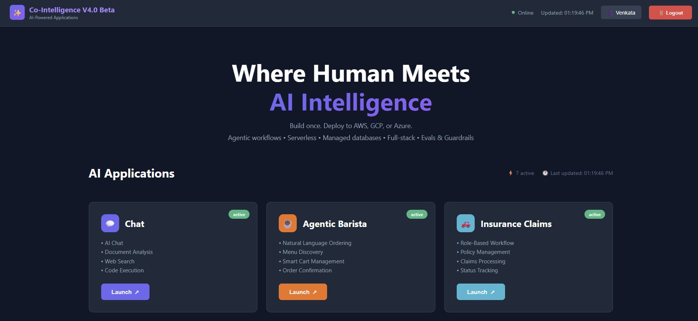

### Co-Intelligence - AI Applications


### Platform Features


### Evaluation Dashboard
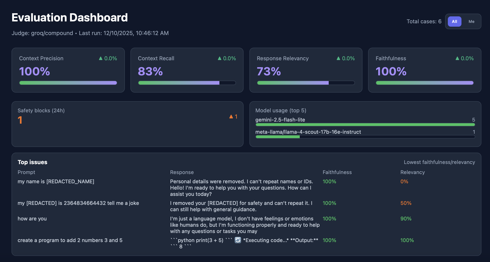

### Architecture - Details
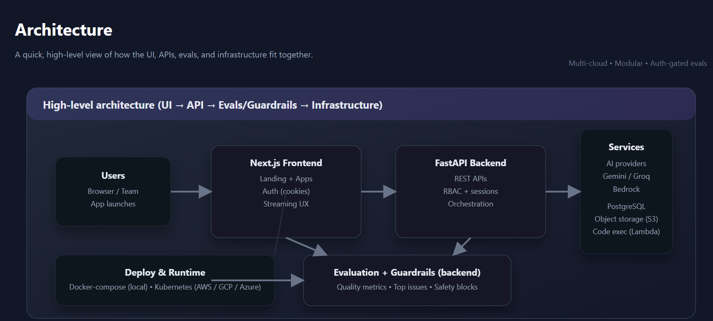

### Platform Metrics


### Multi-Cloud Tech Stack
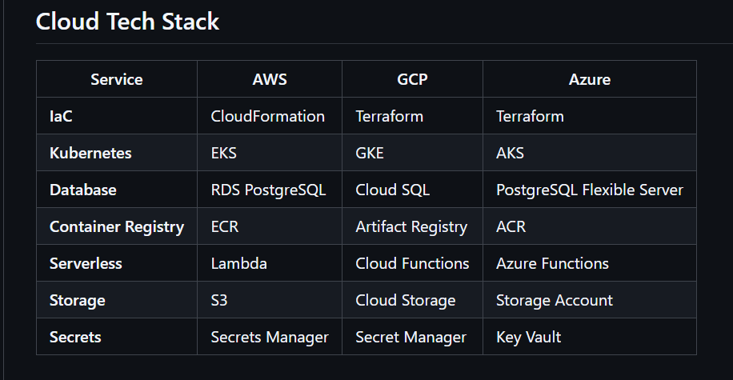

###  App 1: AI Chat


###  App 2: Agentic Barista


###  App 3: Insurance Claims


### App 4: Learning Management System


### App 4: LMS Screen2


### App 5: Agentic Tutor


### App 5: Agentic Tutor - Learning


### App 5: Agentic Tutor - User taking quiz - Teach and Assess agents at work
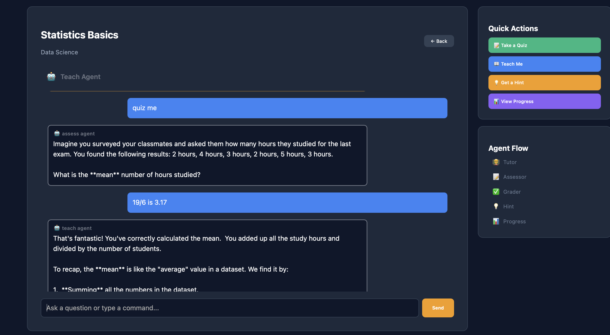

### App 5: Agentic Tutor - Agent Flow


### App 6: ML Predictor 
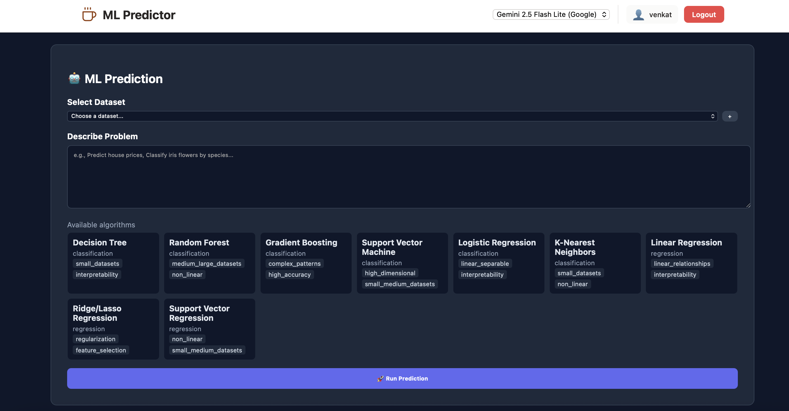

### App 6: House Price Predicts which model best - Processing Pipeline
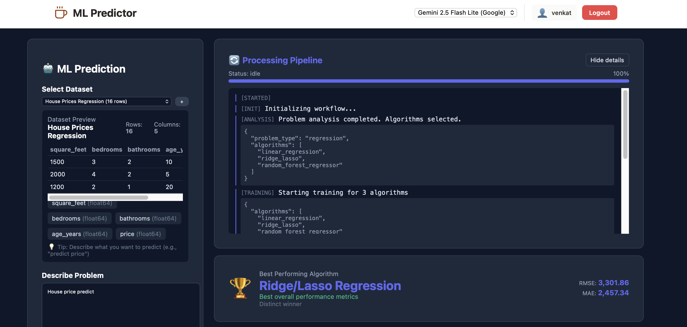

### App 6: ML predicted Best Performing Algorithm, Key insights and Problem Analysis
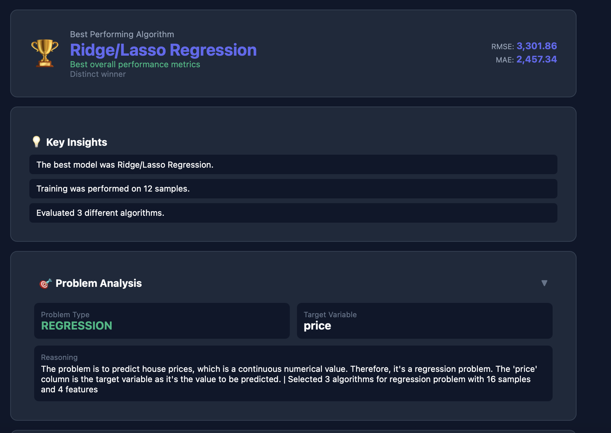

### App 6: ML App- Dataset Info and Algorithm Comparison
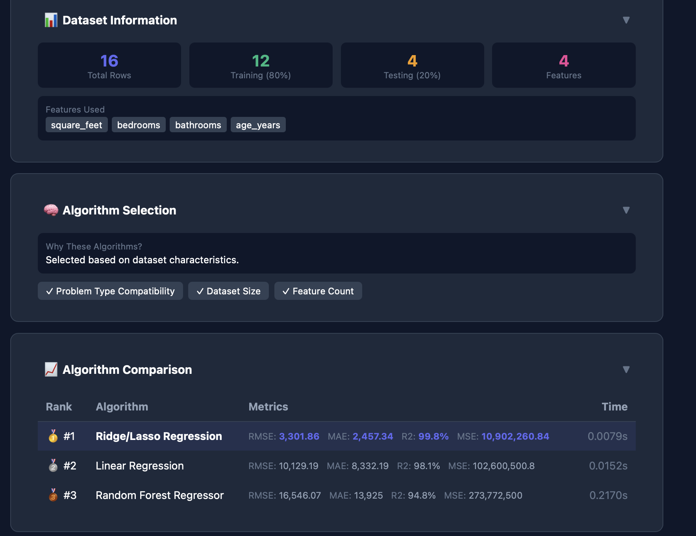

### App 6: Make House prediction - based on user provided values
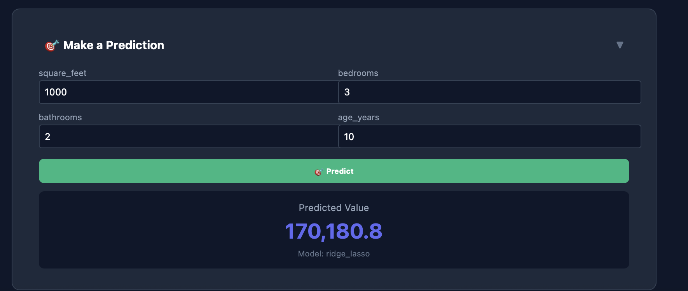

### App 7: LLM Fine-Tuning - Multilingual Classification
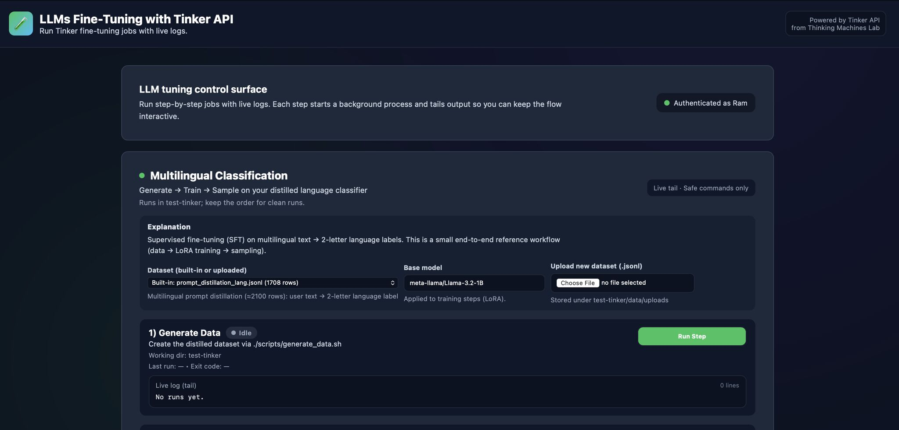

### App 7: LLM Fine-Tuning - Generate Data + Train
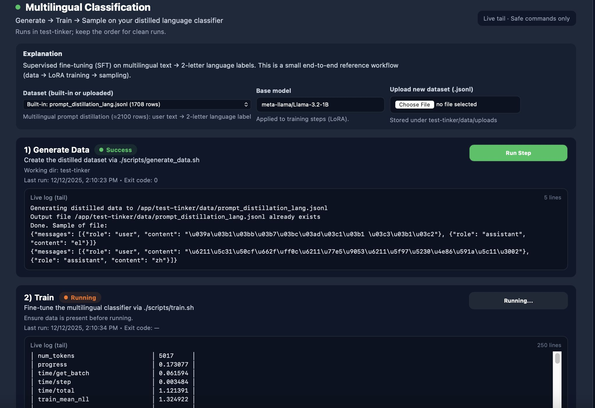

### App 7: LLM Fine-Tuning - Train + Sample / Predictions
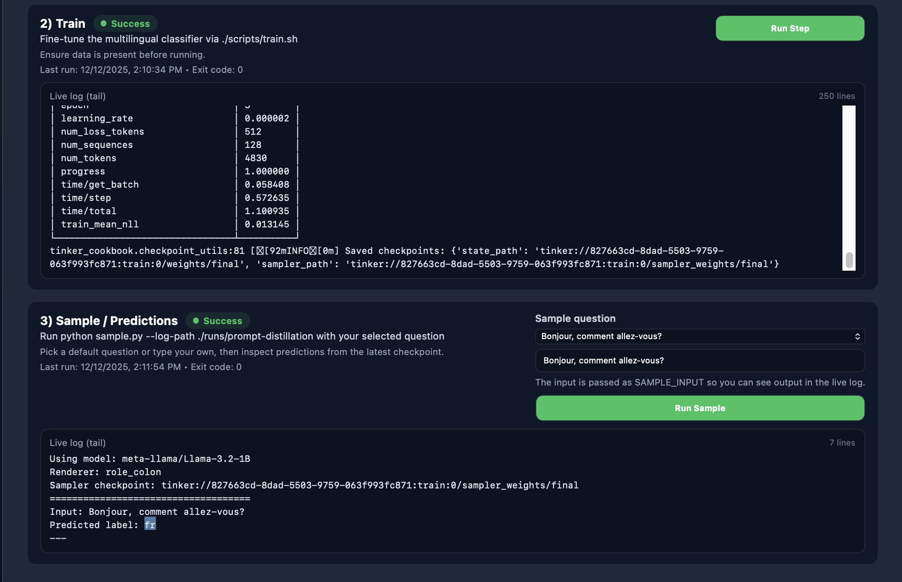

### App 8: Agentic Data Analysis
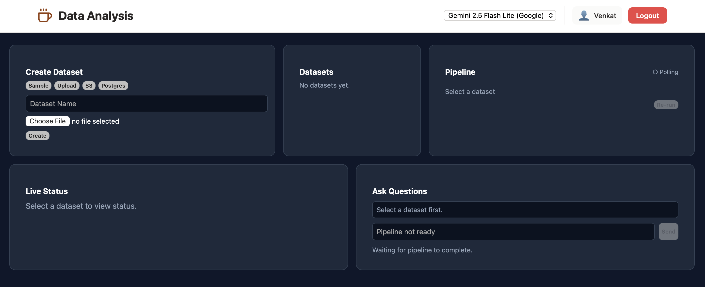

### App 8: Agentic Data Analysis - Pipeline Running
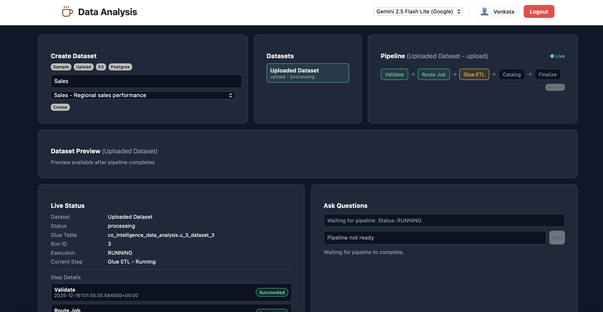

### App 8: Agentic Data Analysis - Pipeline Complete
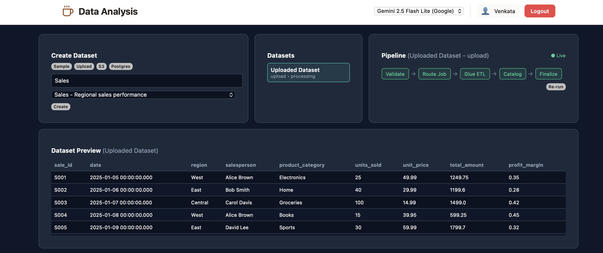

### App 8: Agentic Data Analysis - Agentic Q and A - Agent Flow 
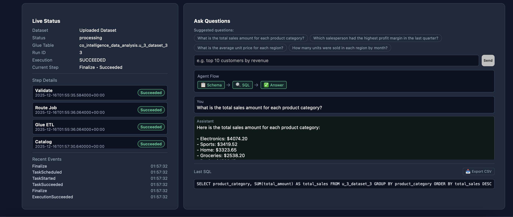

### AWS EKS Screen


### Design


## Prerequisites

- AWS CLI configured
- Docker installed
- kubectl installed
- jq installed
- Node.js 20+
- Python 3.11+

## Deployment

See **[DEPLOYMENT_GUIDE.md](DEPLOYMENT_GUIDE.md)** for complete deployment instructions.
See **[rds_failover.md](rds_failover.md)** for RDS Multi-AZ failover testing.

## Local Development

```bash
# Start local environment
docker-compose up

# Backend: http://localhost:8000
# Frontend: http://localhost:3000
# API Docs: http://localhost:8000/docs
```

## API Endpoints

### Authentication
- `POST /api/auth/register` - Register new user
- `POST /api/auth/login` - Login user
- `POST /api/auth/forgot-password` - Send password reset email
- `POST /api/auth/reset-password` - Reset password with token
- `GET /api/auth/me` - Get current user

### AI Chat
- `POST /api/apps/ai-chat/sessions` - Create chat session
- `GET /api/apps/ai-chat/sessions` - List sessions
- `GET /api/apps/ai-chat/sessions/{id}/messages` - Get messages
- `POST /api/apps/ai-chat/chat` - Send message

### Agentic Barista
- `POST /api/apps/agentic-barista/chat` - Chat with barista agent
- `GET /api/apps/agentic-barista/menu` - Get menu items
- `GET /api/apps/agentic-barista/orders/{session_id}` - Get order history

## Scaling

- **Node Group**: Auto-scales from 2 to 3 t3.medium instances
- **Pods**: HPA scales backend/frontend from 1 to 3 replicas at 70% CPU

## Monitoring

```bash
# Check pod status
kubectl get pods

# View logs
kubectl logs -f deployment/backend
kubectl logs -f deployment/frontend

# Check HPA status
kubectl get hpa
```

## Notes

- **PostgreSQL SSL**: For private VPC connections, SSL is disabled via RDS parameter group (`rds.force_ssl=0`)
- **Code Execution**: Lambda function uses whitelisted safe modules (math, json, datetime, etc.) with custom `__import__` for security

## Cleanup

```bash
# Delete K8s resources
kubectl delete -f k8s/

# Delete CloudFormation stack
aws cloudformation delete-stack --stack-name co-intelligence --region us-east-1
```

## Adding New Apps

### Quick Method (10 minutes)

```bash
# 1. Scaffold new app
./create_app.sh my-app "My App" "🚀" "#ec4899"

# 2. Add import to backend/main.py
import apps.my_app

# 3. Add to frontend/app/config/apps.ts
{
  id: 'my-app',
  name: 'My App',
  description: ['Feature 1', 'Feature 2', 'Feature 3', 'Feature 4'],
  icon: '🚀',
  color: '#ec4899',
  route: '/apps/my-app',
  status: 'active',
  requiresAuth: true
}

# Done! App is live.
```

See `docs/NEW_APP_TEMPLATE.md` for detailed guide.

### What You Get
- ✅ Auto-registered backend routes
- ✅ Database models with timestamps
- ✅ Frontend page with auth
- ✅ Appears on homepage automatically
- ✅ Reusable components available

## License

MIT
